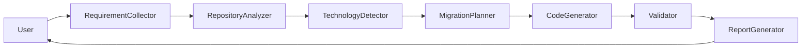

# 🏗 Architecture

## Overview

The AI Database Modernization Agent follows a modular architecture where each stage is responsible for a specific migration task.

---

## High Level Architecture

---

## Components

### Requirement Collector

Collects user inputs:

- Source Database
- Target Database
- Repository
- Constraints

---

### Repository Analyzer

Scans

- SQL
- Entities
- Repository Layer
- Infrastructure

---

### Migration Planner

Creates migration strategy.

---

### Code Generator

Generates

- SQL
- Operations
- Configuration

---

### Validator

Validates

- Queries
- Dependencies
- Tests

---

### Report Generator

Produces

- Migration Report
- Recommendations
