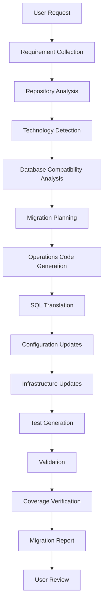
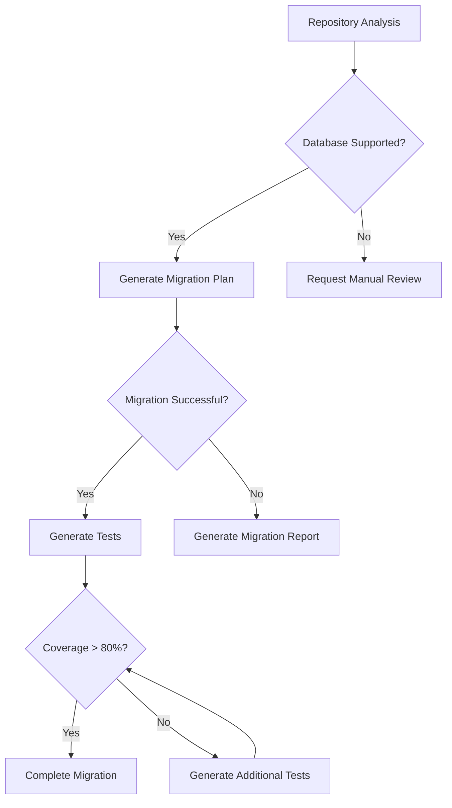

# 🔄 AI Database Modernization Agent Workflow

> This document describes the end-to-end workflow executed by the AI Database Modernization Agent during a database migration engagement.

---

# Overview

The AI Database Modernization Agent follows a structured, validation-driven workflow to modernize database applications while preserving existing application architecture, coding standards, and engineering best practices.

The workflow minimizes manual intervention by combining repository intelligence, migration planning, automated code generation, validation, testing, and reporting.

---

# High-Level Workflow

---

# Workflow Stages

## 1️⃣ Requirement Collection

The agent gathers migration requirements before performing any modifications.

### Inputs

- Source Database
- Target Database
- Repository
- Framework
- Java/Python Version
- Infrastructure Requirements
- Migration Constraints

### Output

Migration scope definition.

---

## 2️⃣ Repository Analysis

The repository is scanned to understand its architecture.

### Activities

- Detect project type
- Locate database components
- Identify repositories
- Identify entities
- Locate SQL queries
- Identify infrastructure definitions
- Detect testing framework

### Output

Repository intelligence report.

---

## 3️⃣ Technology Detection

The agent identifies all technologies involved.

### Examples

- Spring Boot
- Hibernate
- Spring Data JPA
- AWS Lambda
- AWS Glue
- ECS
- Maven
- Gradle

---

## 4️⃣ Database Compatibility Analysis

The agent determines migration complexity.

### Analysis Includes

- SQL dialect comparison
- Unsupported functions
- Stored procedures
- JDBC driver compatibility
- ORM compatibility
- Connection configuration

### Output

Migration feasibility report.

---

## 5️⃣ Migration Planning

The migration strategy is prepared.

### Deliverables

- Components requiring modification
- Risk assessment
- Estimated effort
- Validation checkpoints

---

## 6️⃣ Operations Code Generation

The agent generates required database operations.

### Generated Components

- Repository updates
- Operations classes
- Query builders
- Utility classes
- Exception handling

---

## 7️⃣ SQL Translation

Database-specific SQL is translated.

### Examples

- MySQL → PostgreSQL
- Oracle → PostgreSQL
- SQL Server → PostgreSQL

The agent preserves query intent while adapting syntax.

---

## 8️⃣ Configuration Updates

Configuration files are updated.

Examples include

- application.yml
- application.properties
- Lambda configuration
- Glue connection settings

---

## 9️⃣ Infrastructure Updates

Infrastructure definitions are modernized.

Supported examples

- Terraform
- CloudFormation
- AWS SAM
- CDK

---

## 🔟 Test Generation

The agent updates or generates tests.

### Supported Tests

- Unit Tests
- Integration Tests
- Repository Tests
- Database Tests

---

## 1️⃣1️⃣ Validation

The migration is validated before completion.

Validation includes

- SQL verification
- Dependency verification
- Configuration validation
- Build verification

---

## 1️⃣2️⃣ Coverage Verification

The agent evaluates testing quality.

### Checks

- Code Coverage
- Branch Coverage
- Repository Coverage

Target coverage:

> **80% or higher**

---

## 1️⃣3️⃣ Migration Report

The final deliverable includes:

- Migration Summary
- Updated Components
- SQL Changes
- Infrastructure Changes
- Test Summary
- Coverage Report
- Recommendations

---

# Decision Workflow

---

# Engineering Principles

The agent follows these principles throughout execution.

- Preserve existing application architecture
- Minimize unnecessary code modifications
- Follow repository coding conventions
- Validate every generated SQL statement
- Maintain test coverage above 80%
- Separate migration activities from security remediation
- Generate explainable migration reports
- Prefer incremental and reversible changes

---

# Expected Deliverables

After execution, the user receives:

- ✅ Database Migration Report
- ✅ SQL Compatibility Report
- ✅ Operations Code
- ✅ Configuration Updates
- ✅ Infrastructure Updates
- ✅ Test Suite
- ✅ Coverage Report
- ✅ Migration Recommendations
